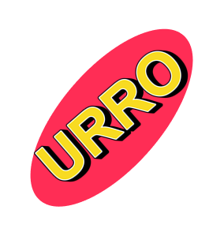

<h1>
    
    &nbsp;URRO
</h1>

A real-time multiplayer UNO game with theme shrek developed as a capstone project. It features authentication, match management, a friends system, and real-time communication between players.

## Repository Structure

- **`apresentation/`**: game images and demonstrations
- **`documents/`**: general project documentation (architecture, API, data modeling, etc.)
- **`source-code/`**: project source code (contains its own `README.md`)

## Collaborators

| Avatar | Nome | GitHub |
|---|---|---|
|  | Kauã Henrique Gonçalves | [@redict](https://github.com/KauaHenriqueGoncalves) |
|  | Rodrigo Costa Albuquerque | [@redict](https://github.com/RodrigoArraes07) |
|  | Pedro Lucas Farias de Melo | [@redict](https://github.com/PedroKeita) |
|  | Davi Correia de Oliveira | [@redict](https://github.com/davicorreia-dev) |