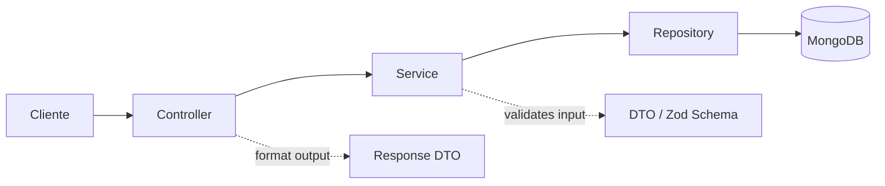
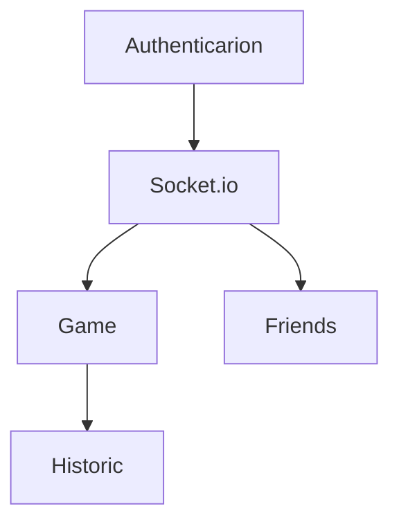

# Overview

## What it is

A backend API for a real-time multiplayer UNO game, developed as an academic capstone project. It provides authentication, match management, a friends system, and real-time communication between players.

## Objective

To allow users to sign up, add friends, create or join game rooms, and play UNO synchronously, with the backend managing the rules, match state, and history persistence.

## Tech Stack

| Layer          | Technology               |
| -------------- | ------------------------ |
| Runtime        | Node.js (ESM)            |
| HTTP Framework | Express                  |
| Real-time      | Socket.io                |
| Database       | MongoDB + Mongoose       |
| Validation     | Zod                      |
| Authentication | JWT (HTTP-only cookies)  |
| Logging        | Pino + pino-pretty       |
| Testing        | Jest + Babel + Supertest |
| Local Infra    | Docker Compose (MongoDB) |


## Layered Architecture

The project follows a well-defined layered pattern, applied to both HTTP routes and Socket.io events:



- **Controller**: receives the request, validates input via DTO (Zod), and delegates to the Service
- **Service**: contains business logic
- **Repository**: the only layer that accesses Mongoose/MongoDB
- **DTO**: input schemas (Zod) and response classes (`fromDocument`, `fromDocumentList`)

## Core Modules



- **Authentication**: JWT via HTTP-only cookie; middleware populates `req.user`
- **Game**: `GameOrchestrator` coordinates the `GameEngine` (pure UNO rules), card persistence, and the scoreboard
- **Friendships**: Full CRUD + real-time invitations via Socket.io
- **History**: Logs match actions, linked to the match orchestrator
- **Socket.io**: Online presence, room events, game join/leave, invitations

## Core Concept: Two-World Pattern

The game state exists in two forms that do not mix directly:

1. **Engine State** — a pure data structure, with no dependency on Mongoose, used to calculate UNO rules
2. **Mongoose Document** — a persisted representation in MongoDB

Adapter methods (`_toEngineState`, `_applyEngineStateToGame`) bridge the two worlds, keeping game logic decoupled from the persistence layer.

## How to Run Locally

```bash
docker compose up -d      # starts MongoDB
npm install
npm run start::watch      # starts with nodemon
```

## Folder Structure (summary)

```
src/
  modules/
    auth/
    game/
    friendship/
    history/
  shared/
    middlewares/
    errors/
tests/
```

