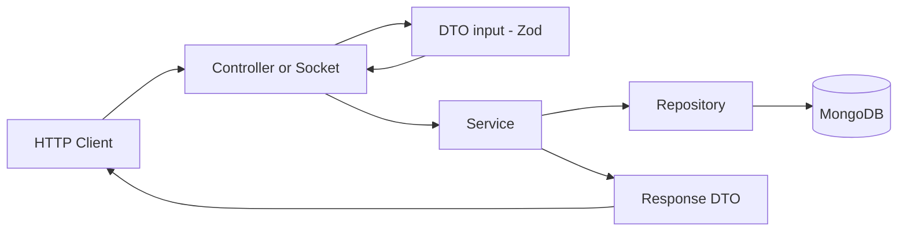
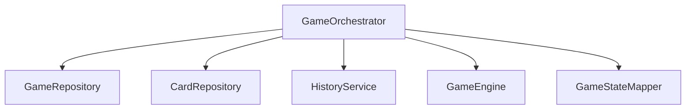
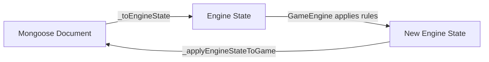
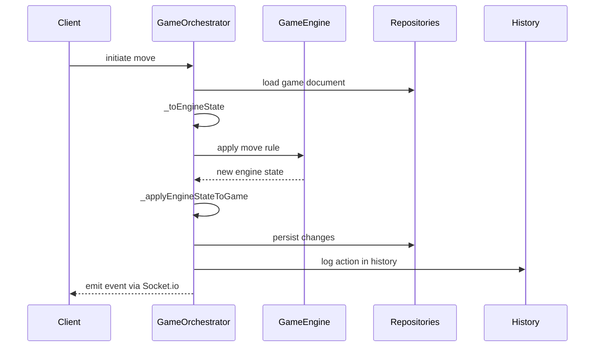
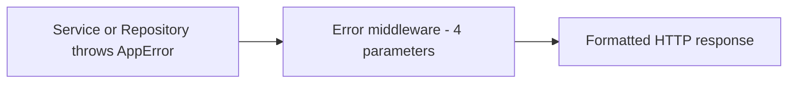

# Architecture

## Layers

The project follows a Controller/Socket → Service → Repository → DTO pattern, applied consistently across both HTTP routes and Socket.io handlers.

### Responsibilities of each layer

- **Controller**: receives the request, validates input using a Zod DTO (`parseOrThrow`), calls the Service, and formats the response. Contains no business logic.
- **Service**: implements business logic and orchestrates calls to one or more Repositories.
- **Repository**: the only layer with direct access to Mongoose; encapsulates queries and updates.
- **DTO**: Zod schemas for input validation; response classes with static methods (`fromDocument`, `fromDocumentList`, `fromDocumentDetails`) for output formatting.

## Dependency Injection

Modules such as `GameOrchestrator` receive repositories and schemas via the constructor, rather than instantiating them internally. This facilitates testing with mocks and reduces coupling.

## Two-World Pattern (Engine vs. Persistence)

The game state exists in two representations that do not mix directly:

- **Engine State**: a pure structure, without Mongoose, used by the `GameEngine` to calculate UNO rules
- **Mongoose Document**: the persisted representation

Helper functions keep the bridge code readable:
- `_collectCardIds`: collects the IDs of cards involved in the play
- `_loadCardMap`: loads cards from the database in batches
- `_hydrateCard`: associates the actual `_id` with the cards generated by `deck.js`

## Match Flow (High-Level)

## Socket.io Layer

Socket.io is integrated as a shared instance via `App.services`, accessible to controllers or services that need to emit real-time events (invitations, presence, game actions).

Important rule: `socket.join(gameId)` must be called explicitly; it does not happen automatically simply by setting `socket.currentGameId`. This dual operation is encapsulated in helper methods such as `enterGameRoom` and `exitGameRoom`.

## Error Handling

A custom error hierarchy (`AppError`, `NotFoundError`, `DatabaseConnectionError`, etc.), each with `statusCode` and `isOperational` properties. A centralized error middleware (4 parameters, Express standard) catches and formats the response.

## Middlewares (order matters)

1. `authMiddleware`: populates `req.user` from the JWT in the cookie
2. `cacheMiddleware`: uses `req.user` to construct the cache key (`userId-method-originalUrl`)
3. Route handler

The cache is an LRU implementation with TTL, built in-house without external dependencies.

## Logging Conventions

Structured Pino logs, `[key=value]` format:
- `debug`: searches/queries
- `warn`: business rule violation
- `info`: successful mutation