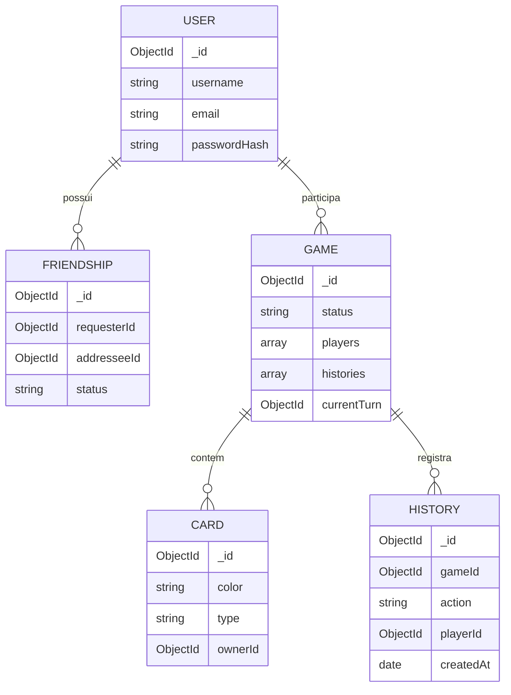

# Data Modeling - UnoShrekApi

## Main Entities

## User

Represents the registered player. Used for authentication and as a reference in matches and friendships.

## Friendship

Manages the relationship between two users (`requesterId` and `addresseeId`), with a `status` (e.g., pending, accepted). Used for the real-time invitation system via Socket.io.

## Game

Represents a match. Maintains the list of players, the `histories` array (recorded actions), and the current turn. It is the central document manipulated by the `GameOrchestrator`.

Note: UNO rule state (players' hands, discard pile, turn direction) is calculated by the `GameEngine` in a separate structure (engine state) and synchronized with this document via the `_toEngineState` / `_applyEngineStateToGame` adapters.

## Card

Cards generated by `deck.js` (pure logic, without `_id`). When starting a match, the `GameOrchestrator` persists the cards via `cardRepository.createMany()` and then hydrates the engine objects with the actual database `_id`s.

## History

Records every relevant action that occurs during a match (e.g., playing a card, drawing a card, skipping a turn), linked to the `gameId` and `playerId`. Integrated into the game flow via `_registerHistory()` in the orchestrator.

Caution: the `action` field must not have `unique: true` — this is a bug that has already been fixed in the project, as the same action legitimately repeats across matches.

## Relevant Indexes and Rules

- `action` (History): no uniqueness constraint
- `ObjectId` comparisons must always convert to `string` before comparing to avoid false negatives.
