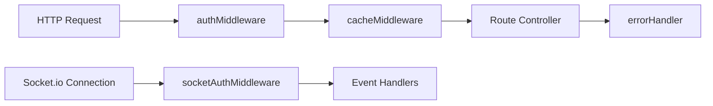
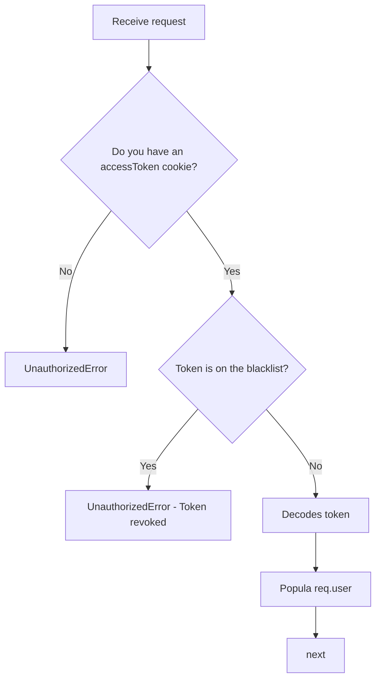
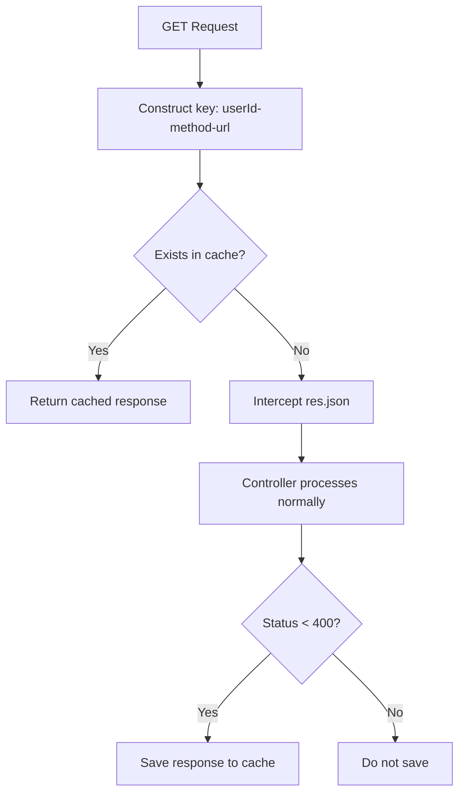
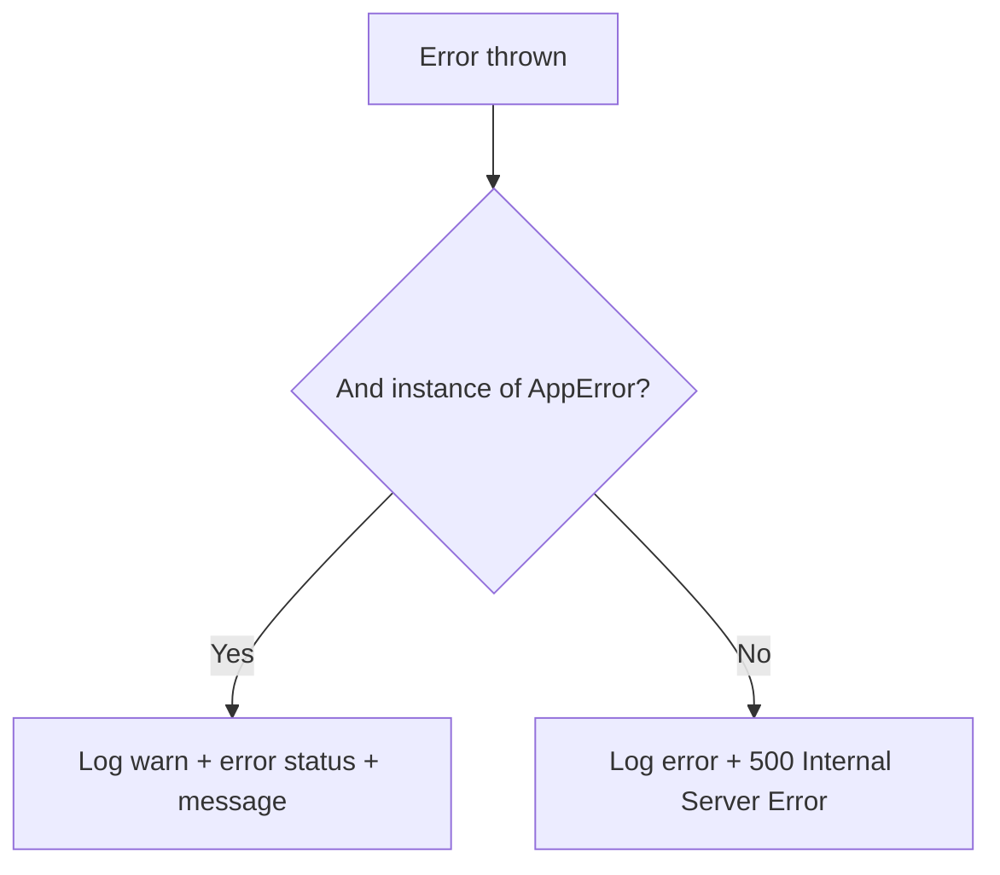
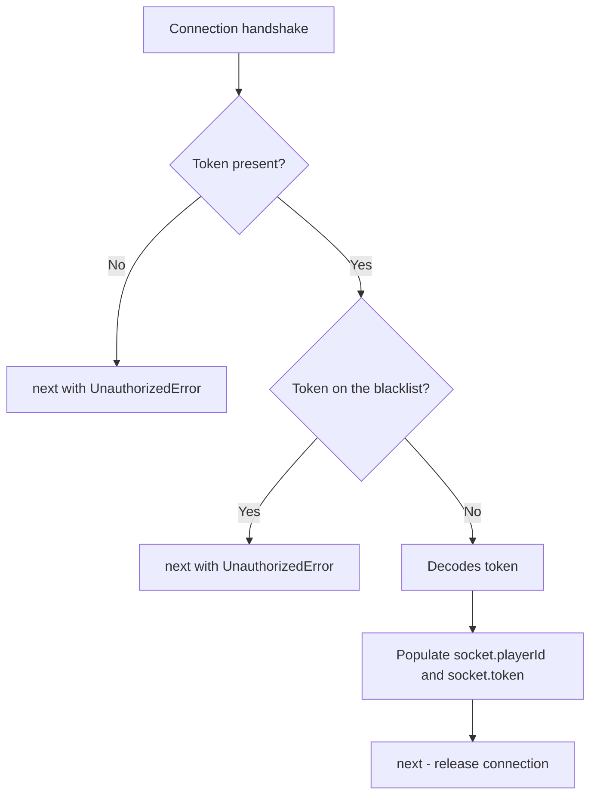

# Middlewares

## Overview

The project uses middleware at both the HTTP layer (Express) and the real-time connection layer (Socket.io). Each has a unique responsibility, and the order of execution matters.

## authMiddleware

Responsible for authenticating HTTP requests via JWT.

**Flow:**
1. Reads the token from the `accessToken` cookie (HTTP-only)
2. If no token is present, returns `UnauthorizedError`
3. Checks if the token is on the blacklist (`BlacklistedTokenRepository`)
4. Decodes the token via `JwtCoder` and populates `req.user`
5. Calls `next()`

> Important: `authMiddleware` must always be registered **before** `cacheMiddleware`, because the cache key depends on `req.user.id`.

## cacheMiddleware

An LRU (Least Recently Used) in-memory cache with TTL, implemented internally (`LruCache`) with no external dependencies.

**Flow:**
1. Operates only on `GET` requests; any other method passes through (`next()`).
2. Constructs a unique key: `{userId}-{method}-{originalUrl}`.
3. If a cache entry exists for the key, it responds immediately without calling the controller.
4. If it does not exist, it intercepts `res.json` to save the response to the cache (only if `statusCode < 400`) before returning it to the client.

Current configuration: `max: 50` entries, `maxAge: 30000` ms (30 seconds).

## errorHandler

Express error middleware (4-parameter signature: `(err, req, res, next)`), centralizing exception handling.

**Flow:**
- If the error is an instance of `AppError` (known operational errors): responds with the error's own `statusCode` and message.
- Otherwise (unexpected error): logs it as `error` and responds with `500 Internal Server Error`, without leaking internal details.

It must be the **last** middleware registered in the Express application.

## socketAuthMiddleware

Equivalent to `authMiddleware`, but for Socket.io connections—authenticates the handshake before allowing the connection.

**Flow:**
1. Retrieves the token from `handshake.headers.accesstoken`, `handshake.auth.token`, or `handshake.query.accesstoken` (in that order of priority)
2. If no token is found, calls `next(new UnauthorizedError())`
3. Checks the token blacklist
4. Decodes the token and populates `socket.token` and `socket.playerId`
5. Calls `next()` to allow the connection

## Summary

| Middleware | Layer | Responsibility | Position |
|---|---|---|---|
| `authMiddleware` | HTTP | JWT authentication (cookie) | Before `cacheMiddleware` |
| `cacheMiddleware` | HTTP | LRU caching of GET responses | After `authMiddleware` |
| `errorHandler` | HTTP | Centralized error handling | Last in the chain |
| `socketAuthMiddleware` | Socket.io | Handshake authentication | Before any event handler |