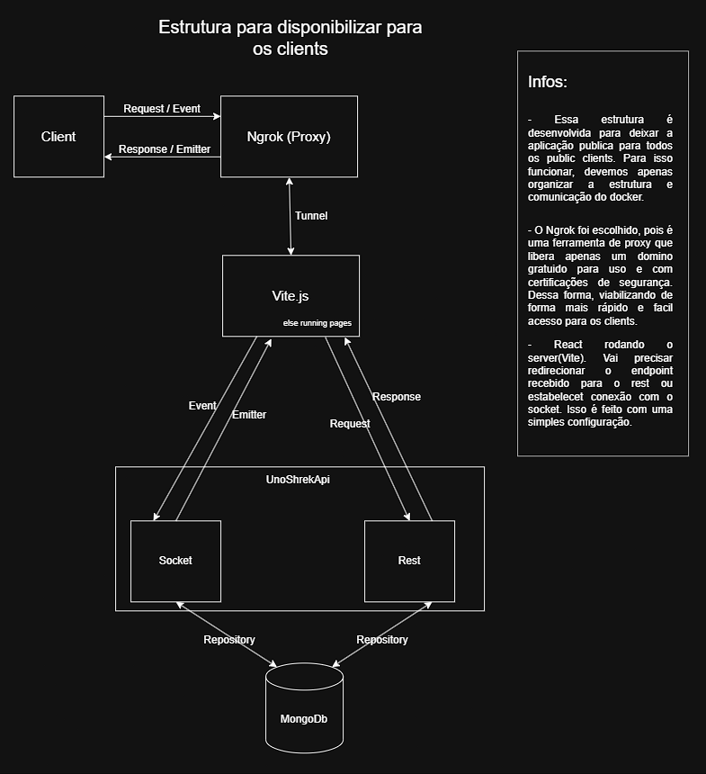

# Infrastructure

## Overview

The application is made publicly available via an Ngrok tunnel, which exposes only the front-end (Vite.js). The front-end acts as a single entry point: client REST requests and socket connections pass through it via a reverse proxy before reaching the API.

<h1>

</h1>

### Why Ngrok?

A proxy tool that provides a free domain with HTTPS certification, eliminating the need to configure DNS or custom certificates. It enables quick and secure client access during development and demonstrations.

### Why the front-end as a proxy (Vite)?

React runs on the Vite development server, which handles the redirection of REST and socket endpoints to the API via a simple configuration (`server.proxy`). This avoids CORS issues and maintains a single origin exposed to the public (the Ngrok domain).

---

## Containers (docker-compose)

| Service     | Role                                      | Exposed Port     |
| ----------- | ----------------------------------------- | ---------------- | --- |
| `mongodb`   | Database (persistence)                    | 27017            |
| `api`       | Back-end REST + Socket.io (UnoShrekApi)   | 3000             |
| `front-end` | React client served by Vite dev server    | 5173             |
| `ngrok`     | Public tunnel pointing to the `front-end` | 4040 (dashboard) | --- |

## Ngrok (`ngrok.yaml`)

Exposes only the `front-end`, which concentrates all traffic (REST + socket):

```yaml
version: "2"
tunnels:
  front-end:
  proto: http
  addr: front-end:5173
```

---

## Routing without front-end (Vite)

`vite.config.js` redirects API calls via the dev server proxy, using environment variables to define prefixes and the target:

```javascript
server: {
    host: '0.0.0.0',
    port: 5173,
    allowedHosts: true, // ngrok domain changes with every renewal (free plan)
    proxy: {
        [env.VITE_API_PREFIX]: {
            target: env.VITE_BACKEND_URL,
            changeOrigin: true,
        },
        [env.VITE_SOCKET_PREFIX]: {
            target: env.VITE_BACKEND_URL,
            changeOrigin: true,
            ws: true,
        },
    },
},
```

### Front-end environment variables

```dotenv
VITE_PROFILE=dev
VITE_API_URL=
VITE_API_PREFIX=/api
VITE_SOCKET_PREFIX=/socket
VITE_BACKEND_URL=http://api:3000
```

- `VITE_BACKEND_URL` uses the Docker service name (`api`), resolved only within the internal Compose network; the browser never accesses this host directly.
- With `VITE_PROFILE=dev`, the client (axios and socket.io) makes relative calls (without the host), letting the Vite proxy handle internal redirection. This avoids CORS issues, as all traffic appears to come from the same origin from the browser's perspective. - With `VITE_PROFILE=prod` (without the Vite proxy, e.g., a static build), the client connected directly to `VITE_BACKEND_URL`.

---

## Request flow summary

1. The client accesses the public Ngrok domain.
2. Ngrok forwards the request to `front-end:5173` (Docker internal network).
3. Vite serves the React files and acts as a reverse proxy for calls to `/api/*` or `/socket/*`.
4. The proxy redirects the request to `api:3000` (service name, resolved via the Docker Compose network).
5. The API processes the request (REST or Socket) and accesses MongoDB via the Repository.
